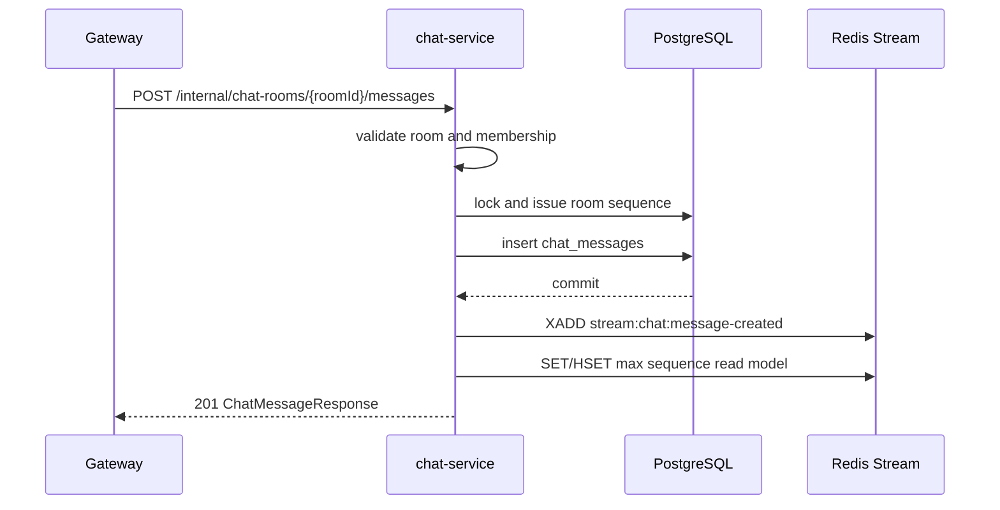

# Chat Messages

## 기능 목적

채팅 메시지 기능은 방 멤버가 텍스트 메시지를 전송하고, 서버가 방별 sequence를 부여해 PostgreSQL에 저장하며, 저장된 메시지 생성 이벤트를 Redis Stream으로 발행해 gateway의 STOMP broadcast를 가능하게 한다.

## 전체 처리 흐름

1. gateway가 `POST /internal/chat-rooms/{roomId}/messages`로 메시지 저장을 요청한다.
2. chat-service가 방 존재 여부와 활성 멤버십을 검증한다.
3. `chat_message_sequences`에서 방별 sequence를 pessimistic lock으로 발급한다.
4. `chat_messages`에 메시지를 저장한다.
5. DB commit 이후 `stream:chat:message-created`에 `CHAT_MESSAGE_CREATED` 이벤트를 발행한다.
6. DB commit 이후 Redis read model의 `chat:room:{roomId}:last-sequence`와 sender의 `chat:user:{senderId}:room-read-sequences`를 message sequence까지 단조 증가시킨다.
7. 클라이언트는 재접속 후 `GET /api/v1/chat-rooms/{roomId}/messages?afterSequence={sequence}&size={size}`로 누락 메시지를 복구한다.



## 핵심 로직과 주요 분기

- 메시지 원천 데이터는 `chat_messages`다.
- Redis Stream id는 비즈니스 id가 아니며, `eventId`와 `messageId`를 별도로 사용한다.
- 메시지 sequence는 `roomId` 안에서만 증가한다.
- 비멤버는 메시지 전송과 history 조회가 모두 `403 CHAT_ROOM_FORBIDDEN`이다.
- 삭제되었거나 존재하지 않는 방은 `404 CHAT_ROOM_NOT_FOUND`다.
- blank 또는 2000자를 초과한 메시지는 `400 CHAT_MESSAGE_CONTENT_INVALID`다.
- sender가 메시지를 보내면 해당 메시지는 sender 본인의 unread count에 포함되지 않도록 sender read sequence를 같은 sequence까지 올린다.
- 읽음 ACK는 Redis에 즉시 반영하고, PostgreSQL `chat_room_read_states`에는 30초 scheduler가 dirty entry를 batch flush한다.
- 방 목록의 `lastMessageSequence`, `lastReadSequence`, `unreadCount`는 Redis 값을 우선 사용하고, Redis miss 시 DB에서 복구해 Redis에 warm-up한다.

## 관련 코드 파일 경로

- `/Users/parkeunbin/Desktop/project/redis-chat-test/chat-service/src/main/java/com/joypeb/chatservice/chatmessage/api/ChatMessageController.java`
- `/Users/parkeunbin/Desktop/project/redis-chat-test/chat-service/src/main/java/com/joypeb/chatservice/chatmessage/application/ChatMessageService.java`
- `/Users/parkeunbin/Desktop/project/redis-chat-test/chat-service/src/main/java/com/joypeb/chatservice/chatmessage/domain/ChatMessage.java`
- `/Users/parkeunbin/Desktop/project/redis-chat-test/chat-service/src/main/java/com/joypeb/chatservice/chatmessage/domain/ChatMessageSequence.java`
- `/Users/parkeunbin/Desktop/project/redis-chat-test/chat-service/src/main/java/com/joypeb/chatservice/chatmessage/infrastructure/RedisChatMessagePublisher.java`
- `/Users/parkeunbin/Desktop/project/redis-chat-test/chat-service/src/main/java/com/joypeb/chatservice/chatread/api/ChatReadReceiptController.java`
- `/Users/parkeunbin/Desktop/project/redis-chat-test/chat-service/src/main/java/com/joypeb/chatservice/chatread/application/ChatReadStateService.java`
- `/Users/parkeunbin/Desktop/project/redis-chat-test/chat-service/src/main/java/com/joypeb/chatservice/chatread/application/ChatReadStateFlushScheduler.java`
- `/Users/parkeunbin/Desktop/project/redis-chat-test/chat-service/src/main/java/com/joypeb/chatservice/chatread/infrastructure/RedisChatReadStateStore.java`
- `/Users/parkeunbin/Desktop/project/redis-chat-test/chat-service/src/main/java/com/joypeb/chatservice/chatread/domain/ChatRoomReadState.java`
- `/Users/parkeunbin/Desktop/project/redis-chat-test/chat-service/src/main/resources/db/migration/V2__create_chat_messages.sql`
- `/Users/parkeunbin/Desktop/project/redis-chat-test/chat-service/src/main/resources/db/migration/V3__create_chat_room_read_states.sql`

## 외부 계약

### REST

- `POST /internal/chat-rooms/{roomId}/messages`
  - header: `X-User-Id`
  - request: `{ "requestId": "req-1", "type": "TEXT", "content": "hello" }`
  - response: `201 Created`
- `GET /api/v1/chat-rooms/{roomId}/messages?afterSequence=0&size=50`
  - header: `X-User-Id`
  - response: `200 OK`
- `GET /api/v1/chat-rooms?scope=public|joined&page=0&size=20`
  - header: `X-User-Id`
  - response addition per room summary:
    - `lastMessageSequence`: 방의 마지막 저장 메시지 sequence
    - `lastReadSequence`: 요청 사용자가 마지막으로 읽은 sequence
    - `unreadCount`: `max(0, lastMessageSequence - lastReadSequence)`
- `POST /internal/chat-rooms/{roomId}/read-receipts`
  - header: `X-User-Id`
  - request:
    ```json
    {
      "requestId": "read-1",
      "type": "CHAT_MESSAGES_READ",
      "payload": {
        "lastReadSequence": 3
      }
    }
    ```
  - response: `202 Accepted`
    ```json
    {
      "success": true,
      "data": {
        "requestId": "read-1",
        "roomId": "00000000-0000-0000-0000-000000000000",
        "lastReadSequence": 3
      },
      "traceId": null,
      "timestamp": "2026-06-12T00:00:00Z"
    }
    ```

### Redis Stream

- key: `stream:chat:message-created`
- eventType: `CHAT_MESSAGE_CREATED`
- fields: `eventId`, `eventType`, `aggregateId`, `occurredAt`, `schemaVersion`, `payload`, `traceId`
- payload: `messageId`, `roomId`, `senderId`, `sequence`, `type`, `content`, `createdAt`
- `occurredAt`과 `payload.createdAt`은 `jackson-datatype-jsr310`을 등록한 `ObjectMapper`로 ISO-8601 문자열로 직렬화한다.
- 읽음 처리를 위한 신규 Redis Stream은 만들지 않는다. 같은 사용자/방의 마지막 read sequence만 필요하므로 Redis Hash와 dirty Set으로 write amplification을 줄인다.

### Redis Read Model

- key: `chat:room:{roomId}:last-sequence`
  - type: String
  - value: 마지막 저장 메시지 sequence 문자열
  - TTL: 없음. PostgreSQL에서 복구 가능한 read model이며 최신 sequence 캐시로 유지한다.
  - update rule: Redis Lua script로 `max(existing, incoming)`만 반영한다.
- key: `chat:user:{userId}:room-read-sequences`
  - type: Hash
  - field: `{roomId}`
  - value: 사용자의 해당 방 마지막 read sequence 문자열
  - TTL: 없음. PostgreSQL 최종 상태와 Redis write-behind 최신 상태를 함께 표현한다.
  - update rule: Redis Lua script로 `max(existing, incoming)`만 반영한다.
- key: `chat:read-state:dirty`
  - type: Set
  - member: `{roomId}:{userId}`
  - TTL: 없음. DB flush 대상 큐 역할이며 flush 성공 전까지 유지한다.
  - remove rule: DB upsert 성공 후 Redis hash 현재 sequence가 flush한 sequence와 같을 때만 제거한다.

### DB

- `chat_message_sequences`
- `chat_messages`
- `chat_room_read_states`
  - primary key: `(room_id, member_id)`
  - columns: `room_id`, `member_id`, `last_read_sequence`, `created_at`, `updated_at`
  - constraint: `last_read_sequence >= 0`
  - index: `idx_chat_room_read_states_member_id`

## 실패 처리와 예외 상황

- 비멤버 전송과 조회는 `403 CHAT_ROOM_FORBIDDEN`이다.
- 존재하지 않거나 삭제된 방은 `404 CHAT_ROOM_NOT_FOUND`다.
- blank 또는 2000자를 초과한 메시지는 `400 CHAT_MESSAGE_CONTENT_INVALID`다.
- Java Time 모듈이 classpath에 없거나 ObjectMapper에 등록되지 않으면 Redis Stream payload 직렬화 중 `Instant` 처리 예외가 발생해 realtime event 발행이 실패한다.
- Redis Stream 발행 실패는 DB 저장 성공 이후 발생할 수 있으므로 운영에서는 outbox 재시도 도입을 검토한다.
- read receipt의 `lastReadSequence`가 방 마지막 sequence보다 크면 `422 CHAT_READ_SEQUENCE_OUT_OF_RANGE`로 거절한다. 서버가 clamp하지 않아 클라이언트 sequence 혼입 버그를 숨기지 않는다.
- Redis 장애 중 read receipt는 실패한다. 읽음 ACK는 Redis 즉시 반영 모델이므로 DB에 직접 우회 write하지 않는다.
- Redis 장애 중 방 목록 조회는 현재 구현에서는 Redis 접근 실패가 그대로 실패할 수 있다. 운영 요구가 강해지면 DB fallback path에 Redis 예외 격리를 추가한다.
- Redis에만 있고 아직 DB flush 전인 최대 30초 read state는 Redis 장애 또는 재시작 시 유실될 수 있다.

## 테스트 및 검증 방법

- `ChatMessageControllerTest`로 메시지 저장, sequence 증가, 비멤버 차단, history 조회를 검증한다.
- `ChatMessageServiceTest`로 DB commit 이후 Redis Stream publisher 호출을 검증한다.
- `RedisChatMessagePublisherTest`로 `Instant`가 포함된 Redis Stream payload JSON 직렬화와 stream field 생성을 검증한다.
- `ChatRoomReadStateTest`로 read sequence 단조 증가 규칙을 검증한다.
- `RedisChatReadStateStoreTest`로 Redis Lua 기반 max update와 dirty marking 호출 계약을 검증한다.
- `ChatReadStateServiceTest`로 read receipt 범위 검증과 accepted response를 검증한다.
- 전체 검증 명령은 `chat-service` 디렉터리에서 `./gradlew test`다.

## 중요한 설계 결정과 trade-off

- PostgreSQL을 메시지 원천 저장소로 사용하고 Redis Stream은 realtime delivery event로만 사용한다.
- sequence는 방 단위로만 보장한다.
- gateway 장애 중 missed realtime event는 REST history로 복구한다.
- Redis Stream event는 gateway가 언어/런타임 설정에 덜 의존해 파싱할 수 있도록 날짜를 timestamp 숫자가 아닌 ISO-8601 문자열로 보낸다.
- 이번 구현은 transaction synchronization으로 commit 이후 publish한다. Redis 장애 시 자동 재발행까지 요구되면 outbox worker를 추가한다.
- read state DB 반영은 30초 write-behind로 지연한다. 메시지 목록 unread 계산은 Redis 최신값을 우선해 UX를 빠르게 유지하지만, Redis 장애 시 최근 읽음 상태 일부 손실을 허용하는 trade-off가 있다.
