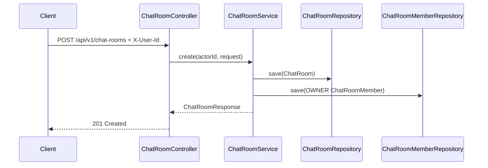

# Chat Rooms

## 기능 목적

채팅방 API는 클라이언트가 채팅방을 생성하고, 공개 방 또는 자신이 참여한 방을 조회하며, 생성자 권한으로 방 정보를 수정하거나 삭제할 수 있게 한다. 채팅방의 원천 데이터는 PostgreSQL에 저장한다.

## 전체 처리 흐름

### 채팅방 생성

1. 클라이언트가 `POST /api/v1/chat-rooms`에 `X-User-Id` header와 방 이름, 설명, 공개 여부를 보낸다.
2. `ChatRoomController`가 header와 request body를 검증한다.
3. `ChatRoomService`가 `ChatRoom`을 생성한다.
4. 같은 transaction 안에서 생성자를 `ChatRoomMemberRole.OWNER` 멤버로 저장한다.
5. API는 `201 Created`, `Location`, `ApiResponse<ChatRoomResponse>`를 반환한다.

### 채팅방 목록 조회

1. 클라이언트가 `GET /api/v1/chat-rooms?scope=public|joined&page=0&size=20`을 호출한다.
2. `public` scope는 삭제되지 않은 공개 방만 조회한다.
3. `joined` scope는 `chat_room_members`에서 요청 사용자가 아직 나가지 않은 방을 조회한다.
4. API는 pagination metadata와 `ChatRoomSummaryResponse` 목록을 반환한다.

### 채팅방 상세 조회

1. 클라이언트가 `GET /api/v1/chat-rooms/{roomId}`를 호출한다.
2. 삭제되지 않은 방만 조회한다.
3. 존재하지 않거나 삭제된 방이면 `404 CHAT_ROOM_NOT_FOUND`를 반환한다.

### 채팅방 수정

1. 클라이언트가 `PATCH /api/v1/chat-rooms/{roomId}`에 변경할 이름, 설명, 공개 여부를 보낸다.
2. 서비스가 방을 조회하고 요청자가 owner인지 확인한다.
3. owner가 아니면 `403 CHAT_ROOM_FORBIDDEN`을 반환한다.
4. owner이면 방 정보를 변경하고 `200 OK`로 변경된 방을 반환한다.

### 채팅방 삭제

1. 클라이언트가 `DELETE /api/v1/chat-rooms/{roomId}`를 호출한다.
2. 서비스가 방을 조회하고 요청자가 owner인지 확인한다.
3. owner이면 `deleted_at`을 설정하고 상태를 `DELETED`로 변경한다.
4. API는 `204 No Content`를 반환한다.



## 핵심 로직과 주요 분기

- `ChatRoom`은 aggregate root이며 방 이름, 설명, owner, 공개 여부, 상태, 삭제 시각을 가진다.
- `ChatRoomMember`는 방과 사용자 사이의 멤버십을 나타낸다.
- 방 생성자는 자동으로 OWNER 멤버가 된다.
- 수정과 삭제는 `ownerId`가 `X-User-Id`와 일치할 때만 허용한다.
- 삭제는 hard delete가 아니라 `deleted_at`과 `DELETED` 상태를 사용하는 soft delete다.
- 삭제된 방은 목록과 상세 조회 대상에서 제외된다.
- 목록 조회 page size는 1 이상 100 이하로 제한한다.

## 관련 코드 파일 경로

- `/Users/parkeunbin/Desktop/project/redis-chat-test/chat-service/src/main/java/com/joypeb/chatservice/chatroom/api/ChatRoomController.java`
- `/Users/parkeunbin/Desktop/project/redis-chat-test/chat-service/src/main/java/com/joypeb/chatservice/chatroom/application/ChatRoomService.java`
- `/Users/parkeunbin/Desktop/project/redis-chat-test/chat-service/src/main/java/com/joypeb/chatservice/chatroom/domain/ChatRoom.java`
- `/Users/parkeunbin/Desktop/project/redis-chat-test/chat-service/src/main/java/com/joypeb/chatservice/chatroom/domain/ChatRoomMember.java`
- `/Users/parkeunbin/Desktop/project/redis-chat-test/chat-service/src/main/java/com/joypeb/chatservice/chatroom/infrastructure/ChatRoomRepository.java`
- `/Users/parkeunbin/Desktop/project/redis-chat-test/chat-service/src/main/java/com/joypeb/chatservice/chatroom/infrastructure/ChatRoomMemberRepository.java`
- `/Users/parkeunbin/Desktop/project/redis-chat-test/chat-service/src/main/resources/db/migration/V1__create_chat_rooms.sql`

## 외부 계약

### REST

- `POST /api/v1/chat-rooms`
  - header: `X-User-Id`
  - request: `{ "name": "general", "description": "General discussion", "publiclyVisible": true }`
  - response: `201 Created`
- `GET /api/v1/chat-rooms?scope=public&page=0&size=20`
  - response: `200 OK`
- `GET /api/v1/chat-rooms?scope=joined&page=0&size=20`
  - response: `200 OK`
- `GET /api/v1/chat-rooms/{roomId}`
  - response: `200 OK` 또는 `404 CHAT_ROOM_NOT_FOUND`
- `PATCH /api/v1/chat-rooms/{roomId}`
  - request: `{ "name": "new-name", "description": "Updated", "publiclyVisible": false }`
  - response: `200 OK` 또는 `403 CHAT_ROOM_FORBIDDEN`
- `DELETE /api/v1/chat-rooms/{roomId}`
  - response: `204 No Content` 또는 `403 CHAT_ROOM_FORBIDDEN`

### DB

- `chat_rooms`
  - primary key: `id`
  - 주요 columns: `name`, `description`, `owner_id`, `visibility`, `status`, `created_at`, `updated_at`, `deleted_at`, `version`
- `chat_room_members`
  - primary key: `id`
  - 주요 columns: `room_id`, `member_id`, `role`, `joined_at`, `left_at`
  - active membership unique index: `(room_id, member_id) where left_at is null`

## 실패 처리와 예외 상황

- request body validation 실패는 `400 REQUEST_VALIDATION_FAILED`를 반환한다.
- `X-User-Id` 누락 또는 형식 오류는 `400 REQUEST_VALIDATION_FAILED`를 반환한다.
- 존재하지 않거나 삭제된 방은 `404 CHAT_ROOM_NOT_FOUND`를 반환한다.
- owner가 아닌 사용자의 수정/삭제는 `403 CHAT_ROOM_FORBIDDEN`을 반환한다.
- 내부 JPA, SQL, stack trace는 API 응답에 노출하지 않는다.

## 테스트 및 검증 방법

`ChatRoomControllerTest`가 다음 흐름을 검증한다.

- 채팅방 생성 시 `201 Created`, `Location`, OWNER 멤버 count 반환
- 공개 방 목록 조회 시 private 방 제외
- 상세 조회
- owner가 아닌 사용자의 수정 실패
- owner의 수정 성공
- 삭제 후 상세 조회 `404`

실행 명령:

```bash
./gradlew test
```

## 중요한 설계 결정과 Trade-Off

- `ChatRoom`과 `ChatRoomMember`를 분리해 이후 초대, 참여, 나가기, 역할 변경 기능을 추가할 수 있게 했다.
- 삭제는 메시지나 감사 로그와의 관계를 고려해 hard delete 대신 soft delete로 구현했다.
- 현재 권한 모델은 단순하게 owner만 수정/삭제할 수 있도록 했다. 관리자나 moderator 역할은 필요해질 때 `ChatRoomMemberRole`에 추가한다.
- `X-User-Id` header는 gateway가 인증 후 전달하는 사용자 식별자라는 전제로 사용한다. 운영 인증 모델이 확정되면 gateway와 service-to-service 신뢰 경계를 별도 ADR로 남겨야 한다.
- Redis와 WebSocket은 현재 채팅방 CRUD에 필요하지 않아 제외했다. 메시지 전송과 실시간 방 이벤트가 추가될 때 Redis Stream 또는 STOMP event 계약을 별도로 설계한다.
