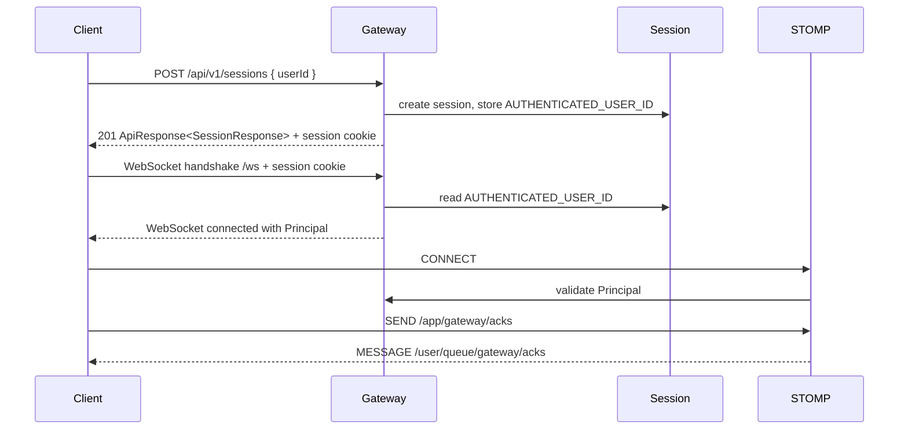

# Local Session And STOMP Gateway

## 기능 목적

gateway는 개발과 테스트를 위해 `userId`만 받는 로컬 로그인 세션을 제공하고, 인증된 세션만 WebSocket/STOMP에 연결되도록 관리한다. 이 기능은 실제 auth 서비스가 도입되기 전까지 gateway 진입점, principal 전파, STOMP destination 정책을 먼저 고정하기 위한 임시 edge 기능이다.

## 전체 처리 흐름

### 로그인 세션 생성

1. 클라이언트가 `POST /api/v1/sessions`에 `userId`를 보낸다.
2. `SessionController`가 Bean Validation으로 `userId` 형식을 검증한다.
3. gateway가 servlet session을 생성하고 `AUTHENTICATED_USER_ID` 속성에 `userId`를 저장한다.
4. 클라이언트는 응답의 session cookie를 이후 REST와 WebSocket handshake에 사용한다.

### WebSocket/STOMP 연결

1. 클라이언트가 session cookie를 포함해 `/ws`로 handshake한다.
2. `GatewayHandshakeInterceptor`가 session의 인증 속성을 확인한다.
3. `GatewayHandshakeHandler`가 `GatewayUserPrincipal`을 생성한다.
4. `StompAuthenticationChannelInterceptor`가 STOMP `CONNECT`, `SUBSCRIBE`, `SEND` frame의 인증과 destination prefix를 확인한다.
5. `StompSessionEventListener`가 connect/disconnect 이벤트를 `StompConnectionRegistry`에 반영한다.
6. 연결 검증용 `SEND /app/gateway/acks`는 `/user/queue/gateway/acks`로 사용자별 ACK 이벤트를 반환한다.



## 핵심 로직과 주요 분기

- `LoginRequest.userId`는 blank, 64자 초과, 허용 문자 외 입력을 거부한다.
- 현재 허용 문자는 영문, 숫자, `.`, `_`, `-`이다.
- 세션이 없거나 `AUTHENTICATED_USER_ID`가 없으면 현재 세션 조회는 `401 Unauthorized`를 반환한다.
- WebSocket handshake에 인증 세션이 없으면 `401 Unauthorized`로 거부한다.
- STOMP `SUBSCRIBE`는 `/topic/**`, `/user/queue/**`만 허용한다.
- STOMP `SEND`는 `/app/**`만 허용한다.
- gateway는 채팅방 멤버십, 메시지 저장, Redis Stream publish 같은 채팅 도메인 로직을 처리하지 않는다.

## 관련 코드 파일 경로

- `/Users/parkeunbin/Desktop/project/redis-chat-test/gateway/src/main/java/com/joypeb/gateway/api/rest/SessionController.java`
- `/Users/parkeunbin/Desktop/project/redis-chat-test/gateway/src/main/java/com/joypeb/gateway/api/rest/GatewayExceptionHandler.java`
- `/Users/parkeunbin/Desktop/project/redis-chat-test/gateway/src/main/java/com/joypeb/gateway/api/stomp/GatewayStompController.java`
- `/Users/parkeunbin/Desktop/project/redis-chat-test/gateway/src/main/java/com/joypeb/gateway/websocket/config/WebSocketConfig.java`
- `/Users/parkeunbin/Desktop/project/redis-chat-test/gateway/src/main/java/com/joypeb/gateway/websocket/handshake/GatewayHandshakeInterceptor.java`
- `/Users/parkeunbin/Desktop/project/redis-chat-test/gateway/src/main/java/com/joypeb/gateway/websocket/handshake/GatewayHandshakeHandler.java`
- `/Users/parkeunbin/Desktop/project/redis-chat-test/gateway/src/main/java/com/joypeb/gateway/websocket/security/StompAuthenticationChannelInterceptor.java`
- `/Users/parkeunbin/Desktop/project/redis-chat-test/gateway/src/main/java/com/joypeb/gateway/websocket/connection/StompConnectionRegistry.java`

## 외부 계약

### REST

- `POST /api/v1/sessions`
  - request: `{ "userId": "user-1" }`
  - response: `201 Created`
  - body: `ApiResponse<SessionResponse>`
- `GET /api/v1/sessions/current`
  - response: `200 OK` 또는 `401 Unauthorized`
- `DELETE /api/v1/sessions/current`
  - response: `204 No Content`

### WebSocket/STOMP

- handshake endpoint: `/ws`
- client publish prefix: `/app`
- broadcast subscription prefix: `/topic`
- user subscription prefix: `/user/queue`
- 연결 검증 destination:
  - `SEND /app/gateway/acks`
  - `SUBSCRIBE /user/queue/gateway/acks`

### 설정

- `gateway.websocket.allowed-origin-patterns`: WebSocket handshake 허용 origin pattern 목록

## 실패 처리와 예외 상황

- REST validation 실패는 `400 Bad Request`와 `REQUEST_VALIDATION_FAILED` code를 포함한 `ProblemDetail`로 응답한다.
- 인증되지 않은 REST 현재 세션 조회는 `401 Unauthorized`와 `UNAUTHENTICATED` code를 반환한다.
- 인증되지 않은 WebSocket handshake는 `401 Unauthorized`로 거부한다.
- 인증되지 않았거나 허용되지 않은 STOMP destination 접근은 STOMP ERROR frame으로 응답한다.
- 내부 예외 class name, stack trace, SQL, Redis command detail은 클라이언트에 노출하지 않는다.

## 테스트 및 검증 방법

- REST 세션 생성, validation 실패, 현재 세션 조회, 미인증 조회, 로그아웃은 `SessionControllerTest`에서 검증한다.
- WebSocket/STOMP는 `GatewayWebSocketIntegrationTest`에서 실제 random port로 검증한다.
- 검증한 흐름:
  - 로그인 session cookie로 `/ws` 연결
  - `/app/gateway/acks` 전송 후 `/user/queue/gateway/acks` 수신
  - 연결 registry의 활성 연결 수 증가와 disconnect 후 감소
  - session cookie 없는 handshake 실패

실행 명령:

```bash
./gradlew test
```

## 중요한 설계 결정과 Trade-Off

- 테스트 편의를 위해 실제 인증 서비스 대신 gateway 로컬 servlet session을 사용한다. 이 방식은 단순하지만 gateway instance 간 session 공유가 없으므로 운영 인증 모델로 사용하지 않는다.
- REST login URL은 동사형 `/login` 대신 resource 중심의 `POST /api/v1/sessions`로 정의했다.
- gateway는 연결과 인증 경계만 담당하고, 채팅 메시지 저장과 Redis Stream publish는 이후 chat 서비스 책임으로 남긴다.
- REST와 STOMP adapter, DTO, WebSocket/STOMP 인프라를 하위 패키지로 분리해 transport 계약과 protocol 인프라 책임이 섞이지 않도록 했다.
- WebSocket origin은 설정으로 외부화했으며, 현재 로컬 개발 기본값은 `*`이다. 운영 환경에서는 명시적인 origin 목록으로 제한해야 한다.
