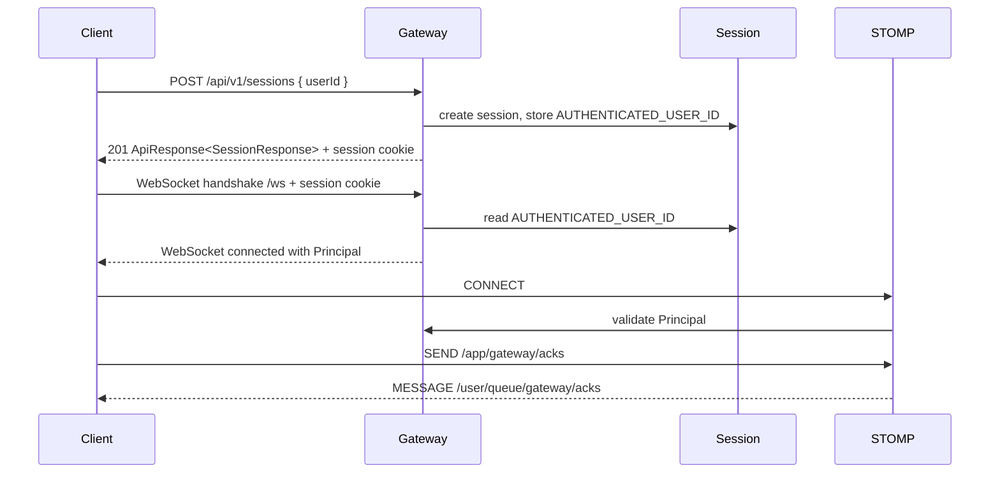
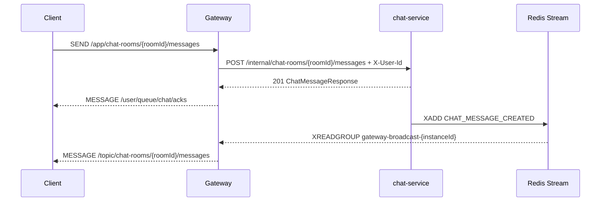
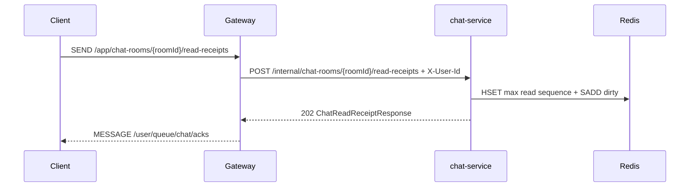
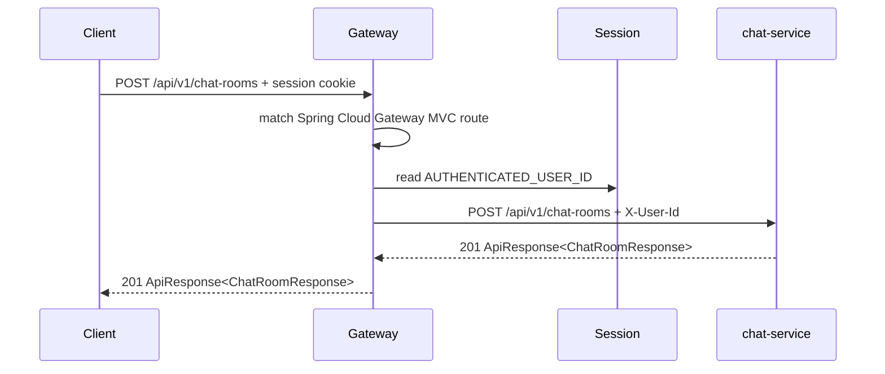

# Local Session, Chat Room REST, And STOMP Gateway

## 기능 목적

gateway는 개발과 테스트를 위해 `userId`만 받는 로컬 로그인 세션을 제공하고, 인증된 세션만 chat-service REST API와 WebSocket/STOMP에 접근하도록 관리한다. 이 기능은 실제 auth 서비스가 도입되기 전까지 gateway 진입점, principal 전파, REST routing, STOMP destination 정책을 먼저 고정하기 위한 임시 edge 기능이다.

## 전체 처리 흐름

### 로그인 세션 생성

1. 브라우저가 다른 local origin에서 호출하면 `GatewayCorsConfig`가 `/api/v1/**` CORS preflight를 처리한다.
2. 클라이언트가 `POST /api/v1/sessions`에 `userId`를 보낸다.
3. `SessionController`가 Bean Validation으로 `userId` 형식을 검증한다.
4. gateway가 servlet session을 생성하고 `AUTHENTICATED_USER_ID` 속성에 `userId`를 저장한다.
5. 클라이언트는 응답의 session cookie를 이후 REST와 WebSocket handshake에 사용한다.

### WebSocket/STOMP 연결

1. 클라이언트가 session cookie를 포함해 `/ws`로 handshake한다.
2. `GatewayHandshakeInterceptor`가 session의 인증 속성을 확인한다.
3. `GatewayHandshakeHandler`가 `GatewayUserPrincipal`을 생성한다.
4. `StompAuthenticationChannelInterceptor`가 STOMP `CONNECT`, `SUBSCRIBE`, `SEND` frame의 인증과 destination prefix를 확인한다.
5. `StompSessionEventListener`가 connect/disconnect 이벤트를 `StompConnectionRegistry`에 반영한다.
6. 연결 검증용 `SEND /app/gateway/acks`는 `/user/queue/gateway/acks`로 사용자별 ACK 이벤트를 반환한다.

### 채팅 메시지 STOMP 전송과 Broadcast

1. 클라이언트가 `SEND /app/chat-rooms/{roomId}/messages`로 메시지를 전송한다.
2. `ChatMessageStompController`가 authenticated principal, room id, STOMP payload를 확인한다.
3. gateway가 `POST /internal/chat-rooms/{roomId}/messages`로 chat-service에 저장을 요청한다.
4. chat-service 저장 성공 응답을 받으면 gateway는 `/user/queue/chat/acks`로 `CHAT_MESSAGE_ACCEPTED` ACK를 반환한다.
5. chat-service가 DB commit 이후 `stream:chat:message-created`에 `CHAT_MESSAGE_CREATED`를 발행한다.
6. 각 gateway instance의 `ChatMessageStreamConsumer`가 자기 consumer group으로 같은 stream event를 읽는다.
7. gateway는 자기 instance에 연결된 client에게 `/topic/chat-rooms/{roomId}/messages`로 `CHAT_MESSAGE_CREATED`를 broadcast한다.

### 채팅 읽음 ACK STOMP 전송

1. 클라이언트가 `/app/chat-rooms/{roomId}/read-receipts`로 읽음 ACK를 전송한다.
2. `ChatMessageStompController`가 authenticated principal, room id, payload를 확인한다.
3. gateway가 `POST /internal/chat-rooms/{roomId}/read-receipts`로 chat-service에 위임한다.
4. chat-service가 Redis read sequence를 단조 증가 방식으로 반영한다.
5. gateway는 `/user/queue/chat/acks`로 `CHAT_MESSAGES_READ_ACCEPTED` ACK를 반환한다.

### 채팅방 REST Routing

1. 클라이언트가 gateway 세션 cookie를 포함해 `POST|GET|PATCH|DELETE /api/v1/chat-rooms...`를 호출한다.
2. Spring Cloud Gateway Server MVC route가 `/api/v1/chat-rooms`와 `/api/v1/chat-rooms/**`를 매칭한다.
3. `ChatServiceGatewayRouteConfig`의 filter가 servlet session에서 `AUTHENTICATED_USER_ID`를 조회한다.
4. 인증 정보가 없으면 chat-service를 호출하지 않고 `401 UNAUTHENTICATED`를 반환한다.
5. 인증 정보가 있으면 route target인 chat-service로 같은 path와 query string을 유지해 HTTP 요청을 전달한다.
6. gateway는 session cookie를 제거하고, 클라이언트가 보낸 `X-User-Id`를 세션 사용자 ID로 덮어쓴다.
7. chat-service 응답의 HTTP status, 주요 response header, body를 그대로 클라이언트에 반환한다.









## 핵심 로직과 주요 분기

- `LoginRequest.userId`는 blank, 64자 초과, 허용 문자 외 입력을 거부한다.
- 현재 허용 문자는 영문, 숫자, `.`, `_`, `-`이다.
- 세션이 없거나 `AUTHENTICATED_USER_ID`가 없으면 현재 세션 조회는 `401 Unauthorized`를 반환한다.
- 세션이 없거나 `AUTHENTICATED_USER_ID`가 없으면 chat-room REST routing도 `401 Unauthorized`를 반환한다.
- gateway는 채팅방 생성, 목록, 상세, 수정, 삭제 API의 도메인 검증을 수행하지 않고 chat-service 응답을 중계한다.
- chat-room REST route는 클라이언트가 보낸 `X-User-Id`를 신뢰하지 않고 gateway session 값을 downstream header로 사용한다.
- `/api/v1/**` REST CORS는 `gateway.cors.allowed-origin-patterns`에 맞는 origin만 허용하고, session cookie 전송을 위해 credentials를 허용한다.
- WebSocket handshake에 인증 세션이 없으면 `401 Unauthorized`로 거부한다.
- STOMP `SUBSCRIBE`는 `/topic/chat-rooms/{roomId}/messages`, `/user/queue/chat/acks`, `/user/queue/chat/errors`, `/user/queue/gateway/acks`만 허용한다.
- STOMP `SEND`는 `/app/gateway/acks`, `/app/chat-rooms/{roomId}/messages`, `/app/chat-rooms/{roomId}/read-receipts`만 허용한다.
- gateway는 채팅방 멤버십, 메시지 저장, Redis Stream publish 같은 채팅 도메인 로직을 처리하지 않는다.
- Redis Stream consumer group은 gateway instance별로 `gateway-broadcast-{instanceId}`를 사용해 모든 gateway가 같은 메시지 생성 이벤트를 읽도록 한다.

## 관련 코드 파일 경로

- `/Users/parkeunbin/Desktop/project/redis-chat-test/gateway/src/main/java/com/joypeb/gateway/api/rest/SessionController.java`
- `/Users/parkeunbin/Desktop/project/redis-chat-test/gateway/src/main/java/com/joypeb/gateway/api/rest/GatewayExceptionHandler.java`
- `/Users/parkeunbin/Desktop/project/redis-chat-test/gateway/src/main/java/com/joypeb/gateway/config/GatewayCorsConfig.java`
- `/Users/parkeunbin/Desktop/project/redis-chat-test/gateway/src/main/java/com/joypeb/gateway/config/GatewayCorsProperties.java`
- `/Users/parkeunbin/Desktop/project/redis-chat-test/gateway/src/main/java/com/joypeb/gateway/config/ChatServiceGatewayRouteConfig.java`
- `/Users/parkeunbin/Desktop/project/redis-chat-test/gateway/src/main/java/com/joypeb/gateway/config/ChatServiceProperties.java`
- `/Users/parkeunbin/Desktop/project/redis-chat-test/gateway/src/main/java/com/joypeb/gateway/api/stomp/GatewayStompController.java`
- `/Users/parkeunbin/Desktop/project/redis-chat-test/gateway/src/main/java/com/joypeb/gateway/chatmessage/api/stomp/ChatMessageStompController.java`
- `/Users/parkeunbin/Desktop/project/redis-chat-test/gateway/src/main/java/com/joypeb/gateway/chatmessage/client/RestChatMessageClient.java`
- `/Users/parkeunbin/Desktop/project/redis-chat-test/gateway/src/main/java/com/joypeb/gateway/chatmessage/stream/ChatMessageStreamConsumer.java`
- `/Users/parkeunbin/Desktop/project/redis-chat-test/gateway/src/main/java/com/joypeb/gateway/websocket/config/WebSocketConfig.java`
- `/Users/parkeunbin/Desktop/project/redis-chat-test/gateway/src/main/java/com/joypeb/gateway/websocket/handshake/GatewayHandshakeInterceptor.java`
- `/Users/parkeunbin/Desktop/project/redis-chat-test/gateway/src/main/java/com/joypeb/gateway/websocket/handshake/GatewayHandshakeHandler.java`
- `/Users/parkeunbin/Desktop/project/redis-chat-test/gateway/src/main/java/com/joypeb/gateway/websocket/security/StompAuthenticationChannelInterceptor.java`
- `/Users/parkeunbin/Desktop/project/redis-chat-test/gateway/src/main/java/com/joypeb/gateway/websocket/connection/StompConnectionRegistry.java`

## 외부 계약

### REST

- `POST /api/v1/sessions`
  - request: `{ "userId": "user-1" }`
  - response: `201 Created`
  - body: `ApiResponse<SessionResponse>`
- `GET /api/v1/sessions/current`
  - response: `200 OK` 또는 `401 Unauthorized`
- `DELETE /api/v1/sessions/current`
  - response: `204 No Content`
- `POST /api/v1/chat-rooms`
  - gateway input: authenticated session cookie
  - forwarded header: `X-User-Id: <session userId>`
  - response: chat-service `201 Created` response
- `GET /api/v1/chat-rooms?scope=public|joined&page=0&size=20`
  - gateway input: authenticated session cookie
  - forwarded header: `X-User-Id: <session userId>`
  - response: chat-service `200 OK` response
- `GET /api/v1/chat-rooms/{roomId}`
  - gateway input: authenticated session cookie
  - forwarded header: `X-User-Id: <session userId>`
  - response: chat-service `200 OK` or error response
- `PATCH /api/v1/chat-rooms/{roomId}`
  - gateway input: authenticated session cookie
  - forwarded header: `X-User-Id: <session userId>`
  - response: chat-service `200 OK` or error response
- `DELETE /api/v1/chat-rooms/{roomId}`
  - gateway input: authenticated session cookie
  - forwarded header: `X-User-Id: <session userId>`
  - response: chat-service `204 No Content` or error response
- `GET /api/v1/chat-rooms/{roomId}/messages?afterSequence=0&size=50`
  - gateway input: authenticated session cookie
  - forwarded header: `X-User-Id: <session userId>`
  - response: chat-service message history response

### WebSocket/STOMP

- handshake endpoint: `/ws`
- client publish prefix: `/app`
- broadcast subscription prefix: `/topic`
- user subscription prefix: `/user/queue`
- 연결 검증 destination:
  - `SEND /app/gateway/acks`
  - `SUBSCRIBE /user/queue/gateway/acks`
- 채팅 메시지 destination:
  - `SEND /app/chat-rooms/{roomId}/messages`
  - `SEND /app/chat-rooms/{roomId}/read-receipts`
  - `SUBSCRIBE /topic/chat-rooms/{roomId}/messages`
  - `SUBSCRIBE /user/queue/chat/acks`
  - `SUBSCRIBE /user/queue/chat/errors`
- 읽음 ACK request payload:
  ```json
  {
    "requestId": "read-1",
    "type": "CHAT_MESSAGES_READ",
    "payload": {
      "lastReadSequence": 3
    },
    "sentAt": "2026-06-12T00:00:00Z"
  }
  ```
- 읽음 ACK success event:
  ```json
  {
    "eventId": "event-id",
    "type": "CHAT_MESSAGES_READ_ACCEPTED",
    "payload": {
      "requestId": "read-1",
      "roomId": "00000000-0000-0000-0000-000000000000",
      "lastReadSequence": 3
    },
    "occurredAt": "2026-06-12T00:00:00Z",
    "traceId": "trace-id"
  }
  ```

### Redis Stream

- key: `stream:chat:message-created`
- consumer group: `gateway-broadcast-{instanceId}`
- consumer name: `gateway.chat-messages.consumer-name`
- broadcast destination: `/topic/chat-rooms/{roomId}/messages`
- gateway 시작 시 stream key가 아직 없어도 `XGROUP CREATE ... MKSTREAM`으로 consumer group과 빈 stream을 함께 생성한다.

### 설정

- `gateway.cors.allowed-origin-patterns`: `/api/v1/**` REST CORS 허용 origin pattern 목록. 기본값은 `http://localhost:*`, `http://127.0.0.1:*`이다.
- `gateway.websocket.allowed-origin-patterns`: WebSocket handshake 허용 origin pattern 목록
- `gateway.chat-service.base-url`: chat-service REST base URL. 기본값은 `CHAT_SERVICE_BASE_URL` 환경 변수이며, 미설정 시 `http://localhost:8081`을 사용한다.
- `gateway.chat-messages.stream-key`: 채팅 메시지 생성 Redis Stream key
- `gateway.chat-messages.instance-id`: gateway instance별 consumer group suffix
- `gateway.chat-messages.group-prefix`: consumer group prefix. 기본값은 `gateway-broadcast`
- `gateway.chat-messages.consumer-name`: Redis Stream consumer name
- `gateway.chat-messages.batch-size`: stream read batch size
- `gateway.chat-messages.block-timeout`: stream read block timeout

## 실패 처리와 예외 상황

- REST validation 실패는 `400 Bad Request`와 `REQUEST_VALIDATION_FAILED` code를 포함한 `ProblemDetail`로 응답한다.
- 인증되지 않은 REST 현재 세션 조회는 `401 Unauthorized`와 `UNAUTHENTICATED` code를 반환한다.
- 인증되지 않은 chat-room REST 호출은 route filter에서 중단되며 `401 Unauthorized`와 `UNAUTHENTICATED` code를 반환한다.
- chat-service가 반환한 validation, not found, forbidden 같은 domain error response는 gateway가 상태 코드와 body를 보존해 반환한다.
- 인증되지 않은 WebSocket handshake는 `401 Unauthorized`로 거부한다.
- 인증되지 않았거나 허용되지 않은 STOMP destination 접근은 STOMP ERROR frame으로 응답한다.
- 내부 예외 class name, stack trace, SQL, Redis command detail은 클라이언트에 노출하지 않는다.
- Redis Stream key가 아직 생성되지 않은 상태에서 gateway가 먼저 시작되어도 consumer group을 생성하고 이후 발행되는 메시지를 소비한다.

## 테스트 및 검증 방법

- REST 세션 생성, validation 실패, 현재 세션 조회, 미인증 조회, 로그아웃은 `SessionControllerTest`에서 검증한다.
- local origin의 session 생성 CORS preflight와 credentials 응답 header는 `SessionControllerTest`에서 검증한다.
- chat-room REST routing은 `ChatRoomGatewayRouteTest`에서 검증한다.
  - 인증된 session으로 `POST /api/v1/chat-rooms` 호출 시 chat-service에 `X-User-Id`와 request body가 전달된다.
  - 클라이언트가 임의로 보낸 `X-User-Id`와 session cookie는 chat-service로 전달되지 않는다.
  - chat-service의 `201 Created`, `Location`, JSON body가 gateway 응답으로 반환된다.
  - 메시지 history REST 요청은 path와 query string을 유지하고 session user id를 `X-User-Id`로 전달한다.
  - 인증되지 않은 chat-room REST 호출은 `401 UNAUTHENTICATED`로 거부된다.
- `ChatMessageStompControllerTest`에서 STOMP 메시지 전송과 읽음 ACK가 chat-service client로 forwarding되고 `/user/queue/chat/acks` payload가 생성되는지 검증한다.
- `ChatMessageStreamConsumerTest`에서 Redis Stream payload가 `/topic/chat-rooms/{roomId}/messages` broadcast와 ACK로 매핑되는지, stream key가 없어도 consumer group을 생성하는지 검증한다.
- WebSocket/STOMP는 `GatewayWebSocketIntegrationTest`에서 실제 random port로 검증한다.
- 검증한 흐름:
  - 로그인 session cookie로 `/ws` 연결
  - `/app/gateway/acks` 전송 후 `/user/queue/gateway/acks` 수신
  - 채팅 메시지 STOMP destination allow/reject 정책
  - 연결 registry의 활성 연결 수 증가와 disconnect 후 감소
  - session cookie 없는 handshake 실패

실행 명령:

```bash
./gradlew test
```

## 중요한 설계 결정과 Trade-Off

- 테스트 편의를 위해 실제 인증 서비스 대신 gateway 로컬 servlet session을 사용한다. 이 방식은 단순하지만 gateway instance 간 session 공유가 없으므로 운영 인증 모델로 사용하지 않는다.
- REST login URL은 동사형 `/login` 대신 resource 중심의 `POST /api/v1/sessions`로 정의했다.
- chat-room REST routing은 수동 controller 대신 Spring Cloud Gateway Server MVC의 `RouterFunction`, `HandlerFunctions.http()`, route filter로 구현한다.
- gateway는 채팅방 REST 요청에서 인증 사용자 ID를 header로 전파하되, 채팅방 소유권이나 멤버십 같은 도메인 판단은 chat-service에 남긴다.
- gateway는 연결, 인증 경계, STOMP ingress, local WebSocket broadcast만 담당하고, 채팅 메시지 저장과 Redis Stream publish는 chat-service 책임으로 남긴다.
- gateway는 읽음 ACK도 상태를 직접 저장하지 않고 chat-service 내부 REST API로 위임한다. Redis key, DB flush, unread count 계산은 chat-service 책임이다.
- 다중 gateway broadcast를 위해 공유 consumer group을 쓰지 않고 gateway instance별 consumer group을 사용한다.
- gateway가 chat-service보다 먼저 시작되는 로컬/운영 순서를 허용하기 위해 Redis Stream consumer group 생성에 `MKSTREAM`을 사용한다. 이 방식은 빈 stream key를 만들 수 있지만, 첫 메시지 발행 전 consumer 시작 실패를 막아 realtime broadcast 가용성을 높인다.
- REST와 STOMP adapter, DTO, WebSocket/STOMP 인프라를 하위 패키지로 분리해 transport 계약과 protocol 인프라 책임이 섞이지 않도록 했다.
- REST CORS 허용 origin은 로컬 HTML 테스트 도구와 IDE preview 서버를 지원하기 위해 `localhost`와 `127.0.0.1`의 모든 포트를 기본 허용한다. 운영 환경에서는 `gateway.cors.allowed-origin-patterns`를 명시적인 origin 목록으로 제한해야 한다.
- WebSocket origin은 설정으로 외부화했으며, 현재 로컬 개발 기본값은 `*`이다. 운영 환경에서는 명시적인 origin 목록으로 제한해야 한다.
